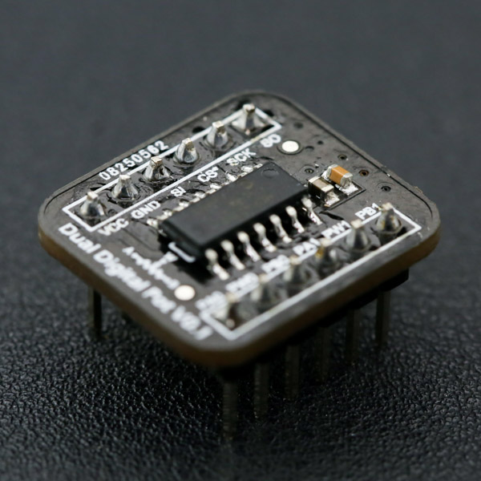

# DFRobot_digitalPot

- [English Version](./README.md)

数字电位器Digital Potentiometer（简称Digital Pot）是一种可以通过Arduino等微控制器编程控制，动态地改变阻值的CMOS模数混合集成电路。与传统机械式电位器相比，数字电位器具有使用灵活（编程控制）、体积小（芯片）、可靠性高（没有机械部件）等显著优点，可在多种应用场景代替传统机械电位器。数字电位器常用于音频播放设备的程控音量调节中，如智能音箱、手机、音乐播放器中的音量调节。此外，如果配合运算放大器，数字电位器还可以用于动态改变电路的主要参数，如：LED直流调光（输出电流）、线性稳压电源（输出电压）、振荡器（频率和振幅）、低通滤波器（带宽）和差分放大器（增益）等应用场景中。



## 产品链接(https://www.dfrobot.com.cn/goods-1508.html)

    SKU：DFR0520

## 目录

* [概述](#概述)
* [库安装](#库安装)
* [方法](#方法)
* [兼容性](#兼容性y)
* [历史](#历史)
* [创作者](#创作者)

## 概述

一个数字电位器库

## 库安装

使用此库前，请首先下载库文件，将其粘贴到\Arduino\libraries目录中，然后打开examples文件夹并在该文件夹中运行演示。

## 方法
```C++

  /**
   * @fn begin
   * @brief 模块初始化
   */
  void begin(void);

  /**
   * @fn digitalPotwrite
   * @brief 将数据写入模块寄存器
   * @param cmd 命令
   * @param val 数据
   */
  void digitalPotwrite(int cmd, int val);

```
## 兼容性

主板               | 通过  | 未通过   | 未测试   | 备注
------------------ | :----------: | :----------: | :---------: | -----
FireBeetle-ESP32  |      √       |             |            | 
FireBeetle-ESP8266|      √       |              |             | 
Mega2560  |      √       |             |            | 
Arduino uno |       √      |             |            | 
Leonardo  |      √       |              |             | 
Micro：bit  |      √       |              |             | 
M0  |      √       |              |             | 

## 历史

- 2022/3/31 - 1.0.0 版本

## 创作者

Written by PengKaixing(kaixing.peng@dfrobot.com), 2021. (Welcome to our [website](https://www.dfrobot.com/))
